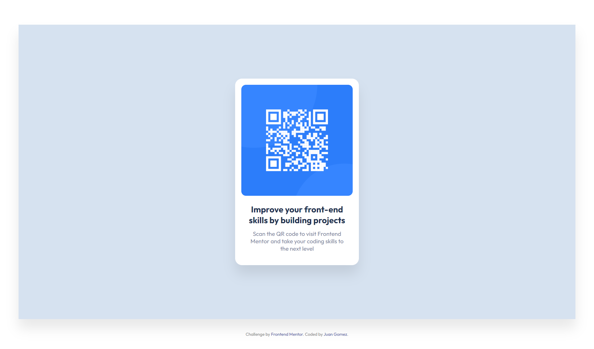

# Frontend Mentor - QR code component solution

This is a solution to the [QR code component challenge on Frontend Mentor](https://www.frontendmentor.io/challenges/qr-code-component-iux_sIO_H). Frontend Mentor challenges help you improve your coding skills by building realistic projects.

## Table of contents

- [Overview](#overview)
  - [Screenshot](#screenshot)
  - [Links](#links)
- [My process](#my-process)
  - [Built with](#built-with)
  - [What I learned](#what-i-learned)
  - [Continued development](#continued-development)
  - [Useful resources](#useful-resources)
- [Author](#author)
- [Acknowledgments](#acknowledgments)

## Overview

This is a qr card component as a challenge from the FrontEndMentor.io site. This
is my very first challenge online, but it won't be the last. Any feedback will
be gratefully accepted, I hope you guys approve of it.

### Screenshot



### Links

- Solution URL: [GitHub](https://github.com/newbpydev/01-qr-code-component-main)
- Live Site URL: [Live Site](https://gracious-hugle-82a000.netlify.app/)

## My process

### Built with

- Semantic HTML5 markup
- CSS custom properties
- Flexbox

### What I learned

I have learned on this project that I should not be afraid of web design. When
you can start to see the connection between the end goal and what you have been
given you can see some connection and adapt. I used the paragraph size to help
me get a general picture of the size that I needed to use for the rest of the document.

```css
.caption-text-box {
  display: flex;
  flex-direction: column;
  gap: 1.2rem;

  padding: 0 1.2rem;
  margin: 1.8rem 0;
}
```

### Continued development

For future development, I will use the grid and flexbox style more often.

### Useful resources

- [Google Fonts](https://fonts.google.com/specimen/Outfit?query=outfit) - This was the font used in the project.
- [CSSTricks](https://css-tricks.com/snippets/css/media-queries-for-standard-devices/) - This is an amazing article which helped me finally understanding the @media
  for mobile and the importance of creating a more responsive site.

## Author

- Website - [Juan Gomez](https://www.newbpydev.com)
- Frontend Mentor - [@newbpydev](https://www.frontendmentor.io/profile/newbpydev)
- Twitter - [@Newb_PyDev](https://twitter.com/Newb_PyDev)

## Acknowledgments

The project may not be perfect compared to my sensei @jonasschmedtman but I need
to thank him because he has shown me the ropes and now I am a confident web
designer.
